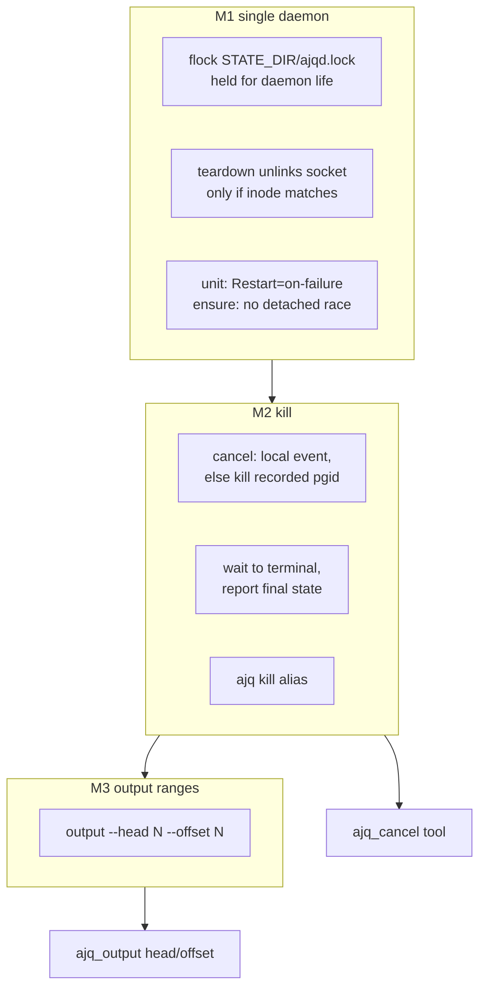

# PLAN — kill a job, and read a range of its output

## Goal

`ajq cancel` must actually kill a running job, and `ajq output` must be able to
read an arbitrary line range (head / offset window), not just the tail.

## What I found (research, before deciding)

`ajq cancel` exists and works **only when one daemon owns the queue**. On this
machine it silently did nothing, because:

- Three `ajqd` processes were alive, all listening on the same socket path and
  all ticking the same `state.db` (pid 491494, 746443, 746639).
- The socket path is reachable by only one of them; a job **enqueued via the
  reachable daemon can be started by any other daemon** (they race on the same
  queue). `cancel` then reaches the reachable daemon, whose in-memory `_running`
  map has no entry for that job → no-op.
- Proven: job `j-5a213f1f703e` had ppid 491494 (an unreachable daemon) while
  `ping` answered from 746639; `cancel` returned `running` and the process lived
  on. After killing the stale daemons, the same `cancel` on a running job
  returned `canceled` / `signal 15` and the process died.
- Root cause: `startup()` guards only with a socket ping (TOCTOU race), and
  `teardown()` unlinks the socket path **by name**, so a dying daemon deletes the
  live daemon's socket and makes it unreachable.

So the feature "kill a job" is blocked by a daemon-lifecycle bug, not by a
missing command. The plan fixes the bug first; a `kill` command that cannot kill
would be theater.

`ajq output` today: `--tail N` (default 40), `--from-start`, `--follow`. No way
to read the first N lines or an interior window.

## Approach

## Decisions

| # | Decision | Why | Rejected |
|---|---|---|---|
| 1 | Singleton by `fcntl.flock(LOCK_EX\|LOCK_NB)` on `$STATE_DIR/ajqd.lock`, held for the daemon's lifetime | Race-free; survives an unlinked socket; auto-releases on process death | pidfile liveness (TOCTOU + stale), socket-ping only (proven racy) |
| 2 | `Restart=on-failure` (systemd), `KeepAlive{SuccessfulExit=false}` (launchd) | The "another daemon serves → exit 0" path must not crash-loop every 2s | keep `Restart=always` (loops), exit non-zero (crash-loop) |
| 3 | `ensure_running` starts the unit/plist and does **not** fall back to a detached spawn when one is installed | Removes the systemd-vs-detached race at the source | keep falling back (recreates the bug) |
| 4 | Teardown unlinks the socket only when its inode is still ours | A dying daemon must not delete a live daemon's socket | unlink by name (proven to break the live daemon) |
| 5 | Cancel waits (bounded by `kill_grace_s + 2s`) for terminal, prints the final state; `--no-wait` opts out | One call confirms the kill; today it prints `running` and lies | fire-and-forget (unverifiable) |
| 6 | If a running job is not in local `_running`, cancel kills its recorded pid's process group | Covers pre-fix stale daemons and a dead runner thread | rely on the lock alone (no recovery from today's mess) |
| 7 | `ajq cancel` stays canonical; `ajq kill` is an alias; plugin tool `ajq_cancel` | One verb, the user's word accepted; the tool description says "cancel/kill" | rename to `kill` (breaks docs/scripts), two tools (redundant) |
| 8 | Output range = `--head N` + `--offset N`; `--offset N --tail M` = window `[N, N+M)` | Composes with the existing flags, no new parser | `--range A:B` (redundant), byte ranges (logs are line-oriented) |

## Milestones

1. **M1 single daemon** — flock lock, inode-safe teardown, unit/ensure policy.
2. **M2 kill** — cancel fallback by pgid, bounded wait + final state, `kill` alias.
3. **M3 output ranges** — `--head` / `--offset` on `ajq output`.
4. **M4 surfaces** — `ajq_cancel` tool, `ajq_output` head/offset, skill/README/docs.
5. **M5 verify + deploy** — full suite, rebuild zipapp, one-time stale-daemon
   cleanup, live end-to-end.

## Risks

- `flock` on an exotic filesystem: `~/.local/state` is a normal FS; not a concern
  here, and `doctor` will show one daemon.
- `Restart=on-failure`: a daemon that exits 0 for a real failure would not
  restart. Only the "another daemon serves" path exits 0; `ensure` covers the gap.
- Behavior change: `ajq cancel` now blocks up to ~`kill_grace_s`. Mitigated by
  `--no-wait`; documented.
- The live machine currently has three stale daemons; M5 kills them once. This is
  operational, not code.
