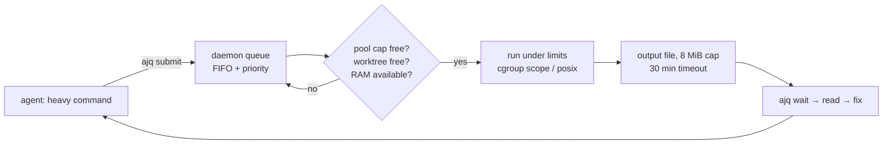

# ⚡ ajq

> One jobs-queue daemon in front of every agent: **submit → capped queue → wait → read output**, so parallel agents stop exhausting the machine.

[](https://github.com/assawalhy/agents-jobs-queue/actions/workflows/ci.yml)


Parallel agents run builds, tests and typechecks at the same time, in several
worktrees, and fill the box: swap pressure, a 40-minute build starving a
6-second lint, and a `zsh: killed` nobody can explain. ajq puts one daemon in
front of all of them. Agents submit instead of blocking, and the daemon decides
*when* things run.

## 🚀 Install

```bash
curl -fsSL https://raw.githubusercontent.com/assawalhy/agents-jobs-queue/main/install.sh | bash
```

The installer fetches its own payload, installs, and cleans up after itself — no
clone, nothing left behind. Restart your harness afterwards.

```bash
# pin a release
curl -fsSL https://raw.githubusercontent.com/assawalhy/agents-jobs-queue/main/install.sh | AJQ_VERSION=v0.1.2 bash

# CLI + hooks only, no boot service (no systemd unit, no linger)
curl -fsSL https://raw.githubusercontent.com/assawalhy/agents-jobs-queue/main/install.sh | bash -s -- --no-daemon

# pick harnesses
curl -fsSL https://raw.githubusercontent.com/assawalhy/agents-jobs-queue/main/install.sh | bash -s -- --target claude,codex

# uninstall (add --purge to drop job history and the estimate cache too)
curl -fsSL https://raw.githubusercontent.com/assawalhy/agents-jobs-queue/main/install.sh | bash -s -- --uninstall
```

## 🔁 The loop



## 📦 What you get

| Piece | Invoke | What it does |
| --- | --- | --- |
| `ajq submit` | `ajq submit -- pytest -q` | Queue a command; returns a job id, not a hang |
| `ajq wait` | `ajq wait <id> --tail 80` | Block until terminal; one call returns the final state and the log; exit 0 only for `done` |
| `ajq status` | `ajq status <id> --fields state,elapsed_s` | State, queue position, ETAs, output size — only the keys you ask for |
| `ajq output` | `ajq output <id> --follow` | The captured output, tailable and streamable |
| `ajq stats` | `ajq stats` | Estimate cache with real MAPE accuracy per signature |
| `ajq doctor` | `ajq doctor` | Backend, socket, unit state, linger, memory, guard mode |
| `ajq prune` | `ajq prune --all` | Drop finished jobs and their output |
| `ajq` skill | auto-loaded | Tells the agent when to submit instead of running |
| hooks | automatic | OpenCode plugin, Claude/Codex/Kiro hooks, Pi extension |

## 🧠 Good to know

- 🧱 **Concurrency is pooled**: `heavy 2 · normal 4 · service 3 · light 6`, global cap 8. A cheap lint never queues behind a Gradle build.
- 🌳 **Serialized per git worktree** by default, so two agents in one checkout never run overlapping commands. `--serial-key none` opts out.
- 🧠 **Estimates come from a real cache**: Welford mean + 0.5σ over `kind|tool|dirs|filecount`, cold-starting from per-kind defaults. `ajq stats` prints MAPE so the accuracy is checkable.
- 🪟 **macOS cannot hard-cap a job's RAM** — no cgroup write access, and `RLIMIT_AS` breaks Node/JVM/Docker. The free-RAM admission gate does the work there and `ajq doctor` says so.
- ⚠️ The guard defaults to `warn` (it tells the agent, it does not block). On Claude/Codex/Kiro that is a note injected before the call; on OpenCode V2 it is a note appended to the tool result. Set `hooks.guard_mode` to `block` to deny heavy commands outright.
- 🧩 Kilo, Kimi, DeepSeek and Cursor get the skill but no hooks — no verified hook API for them.

## 📄 License

MIT. See [LICENSE](LICENSE).

## 🔧 Details

Guards, defaults, the config reference, the harness matrix and the state layout
live in [docs/DETAILS.md](docs/DETAILS.md).

Regenerate the demo with `tools/demo-gif/build.sh` (needs `playwright-cli` and
`ffmpeg`; the committed GIF is what the README shows).